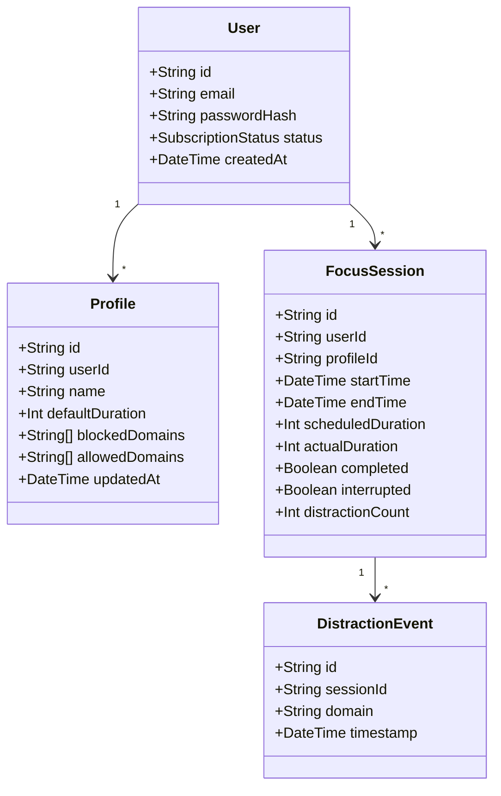

# FocusFlow Architecture Specification

## 1. Executive Summary & Product Vision

**FocusFlow** is an enterprise-grade productivity platform and website blocker designed to cultivate deep work habits, eliminate digital distractions, and empower users with actionable focus analytics. The platform begins as a local-first, privacy-respecting **Chrome Extension (Manifest V3)** that operates completely independently of any cloud infrastructure, and smoothly transitions in later phases into a synchronized multi-device productivity ecosystem backed by a Next.js web dashboard and a Node.js/PostgreSQL cloud API.

```
+------------------------------------------------------------------------------------+
|                                    FOCUSFLOW                                       |
|                                                                                    |
|   +--------------------------+  +--------------------------+  +----------------+   |
|   | Chrome/Edge Extension    |  | Web App & Dashboard      |  | Backend API    |   |
|   | (React + Vite + MV3)     |  | (Next.js + Tailwind)     |  | (Express + TS) |   |
|   +------------+-------------+  +------------+-------------+  +-------+--------+   |
|                |                             |                        |            |
|                |      Local Storage First    |                        |            |
|                |      (chrome.storage.local) |                        |            |
|                +-----------------------------+                        |            |
|                               |                                       |            |
|                               v  (Future Phase 17 Sync)               v            |
|                    +------------------------------------+   +------------------+   |
|                    | Sync Engine & Conflict Resolver    |<->| PostgreSQL +     |   |
|                    | (Last-Write-Wins / Append Logs)    |   | Prisma ORM       |   |
|                    +------------------------------------+   +------------------+   |
+------------------------------------------------------------------------------------+
```

---

## 2. Monorepo Structure

FocusFlow employs a clean, modular monorepo structure designed for strict separation of concerns, rapid local compilation, shared type safety, and zero leakage of server secrets into client extension bundles.

```text
focusflow/
│
├── apps/
│   ├── extension/               # Chrome & Edge Browser Extension (MV3)
│   │   ├── src/
│   │   │   ├── background/      # Service worker, lifecycle, alarm listeners
│   │   │   ├── popup/           # React popup UI (fast mount, interactive timer)
│   │   │   ├── options/         # React options page (profiles, blocklists, analytics)
│   │   │   ├── blocked/         # Custom block splash page (served via chrome-extension://)
│   │   │   ├── components/      # Shared accessible UI components
│   │   │   ├── hooks/           # React hooks (useTimer, useStorage, useProfiles)
│   │   │   ├── services/        # Timer engine, DNR rule manager, distraction recorder
│   │   │   ├── storage/         # Typed wrapper over chrome.storage.local
│   │   │   ├── utils/           # Domain normalizer, timestamp calculators, formatters
│   │   │   ├── types/           # Extension-specific and imported shared types
│   │   │   └── constants/       # Presets, default profiles, storage keys
│   │   ├── public/
│   │   │   ├── icons/           # 16, 32, 48, 128 px icons
│   │   │   └── sounds/          # Session completion chimes
│   │   ├── manifest.json        # Manifest V3 configuration
│   │   ├── vite.config.ts       # Multi-page build configuration (popup, options, blocked)
│   │   ├── tsconfig.json        # Strict TypeScript configuration
│   │   └── package.json
│   │
│   ├── web/                     # Web Application & Dashboard (Phase 18+)
│   │   ├── app/                 # Next.js App Router (/dashboard, /analytics, /billing)
│   │   ├── components/          # Dashboard charts, data tables, goal progress
│   │   ├── lib/                 # API client, session helpers
│   │   ├── hooks/               # React queries, auth state
│   │   ├── tsconfig.json
│   │   └── package.json
│   │
│   └── api/                     # Cloud Backend API (Phase 15+)
│       ├── src/
│       │   ├── controllers/     # Auth, session, profile, analytics controllers
│       │   ├── routes/          # RESTful endpoints
│       │   ├── services/        # Stripe webhooks, token generation, sync logic
│       │   ├── middleware/      # JWT auth, rate limiting, error handling, validation
│       │   ├── utils/           # Security utilities, hashing
│       │   └── types/           # API request/response contracts
│       ├── tsconfig.json
│       └── package.json
│
├── packages/
│   ├── shared/                  # Common TypeScript interfaces & constants
│   │   ├── src/
│   │   │   ├── types/           # Session, Profile, Timer, Analytics types
│   │   │   └── constants/       # Domain regexes, default timers, error codes
│   │   └── package.json
│   │
│   ├── validation/              # Shared runtime validation (Zod schemas)
│   │   ├── src/
│   │   │   ├── domain.ts        # Domain normalization & validation schemas
│   │   │   ├── profile.ts       # Profile validation schemas
│   │   │   └── session.ts       # Focus session schemas
│   │   └── package.json
│   │
│   └── config/                  # Shared linting, formatting, TS base configs
│       ├── eslint/
│       └── typescript/
│
├── prisma/                      # Database ORM definition (Phase 15+)
│   └── schema.prisma            # PostgreSQL schemas
│
├── tests/                       # Global & E2E integration test suites
│   ├── e2e/                     # Playwright browser extension test suite
│   └── mocks/                   # Chrome API mocks for unit testing
│
├── docs/                        # Architecture, security, testing, store compliance
├── store-assets/                # Icons, promo tiles, screenshot mocks
├── .env.example                 # Documented environment variables template
├── package.json                 # Monorepo root workspaces
├── tsconfig.base.json           # Root TypeScript strict settings
└── README.md
```

---

## 3. Storage Strategy: Local-First to Cloud Sync

### 3.1 Local Storage Schema (`chrome.storage.local`)
To guarantee lightning-fast performance, offline reliability, and zero initial server dependency, the extension operates entirely on `chrome.storage.local`. All keys are namespaced and strictly typed.

```typescript
// Core Data Contract in packages/shared/src/types/storage.ts

export type TimerStatus = 'idle' | 'running' | 'paused' | 'completed';
export type SessionMode = 'custom' | 'pomodoro';
export type PomodoroPhase = 'focus' | 'short_break' | 'long_break';

export interface ActiveTimerState {
  status: TimerStatus;
  mode: SessionMode;
  pomodoroPhase?: PomodoroPhase;
  pomodoroCycleCount: number; // e.g., 1 to 4
  profileId: string;
  durationSeconds: number;
  startedAt: number | null;     // Epoch timestamp in milliseconds
  pausedAt: number | null;      // Epoch timestamp in milliseconds
  accumulatedPausedMs: number;  // Total ms spent paused
  targetEndTime: number | null; // startedAt + durationSeconds*1000 + accumulatedPausedMs
}

export interface FocusProfile {
  id: string;
  name: string;
  icon?: string;
  color?: string;
  durationMinutes: number;
  blockedDomains: string[];   // Normalized e.g., ["youtube.com", "instagram.com"]
  allowedDomains: string[];   // Specific overrides e.g., ["music.youtube.com"]
  isPreset: boolean;
  createdAt: number;
  updatedAt: number;
}

export interface CompletedSessionRecord {
  id: string;
  profileId: string;
  profileName: string;
  mode: SessionMode;
  startTime: number;
  endTime: number;
  scheduledDurationSeconds: number;
  actualDurationSeconds: number;
  completed: boolean;
  interrupted: boolean;
  interruptionReason?: string;
  distractionAttemptsCount: number;
  syncedWithCloud?: boolean;
}

export interface DistractionAttemptRecord {
  id: string;
  sessionId: string;
  domain: string;
  timestamp: number;
}

export interface FocusSchedule {
  id: string;
  name: string;
  profileId: string;
  daysOfWeek: number[]; // 0 = Sunday, 1 = Monday, ..., 6 = Saturday
  startTime: string;    // "HH:mm" (24-hour format)
  endTime: string;      // "HH:mm"
  isEnabled: boolean;
}

export interface UserSettings {
  theme: 'system' | 'light' | 'dark';
  soundEnabled: boolean;
  soundVolume: number;
  soundChoice: 'bell' | 'chime' | 'digital';
  notificationsEnabled: boolean;
  strictMode: boolean; // Requires password/typing challenge to abort
  autoStartBreaks: boolean;
  autoStartFocus: boolean;
  pomodoroFocusMinutes: number;
  pomodoroShortBreakMinutes: number;
  pomodoroLongBreakMinutes: number;
  pomodoroCyclesBeforeLongBreak: number;
  dailyGoalMinutes: number;
  weeklyGoalMinutes: number;
}

export interface StorageSchema {
  version: number;
  activeTimer: ActiveTimerState;
  activeProfileId: string;
  profiles: Record<string, FocusProfile>;
  sessions: CompletedSessionRecord[];
  distractionAttempts: DistractionAttemptRecord[];
  schedules: FocusSchedule[];
  settings: UserSettings;
  syncMetadata?: {
    lastSyncTimestamp: number;
    userId: string | null;
    authToken: string | null;
  };
}
```

### 3.2 Cloud Sync Mapping (Phase 15+ Prisma & PostgreSQL)
When the user connects an account in Phase 17, the local records map 1-to-1 to Prisma models without loss of fidelity.



---

## 4. Permission Strategy (Least-Privilege Principle)

FocusFlow strictly implements the **Least Privilege Principle** as enforced by Google Chrome Web Store Developer Policies and Microsoft Edge Add-ons standards.

| Permission | Purpose | Justification |
| :--- | :--- | :--- |
| `storage` | Save user profiles, active timer state, settings, and session statistics. | Essential for core functionality. State persists locally in the browser sandbox. |
| `alarms` | Periodic wakeup mechanism for the Manifest V3 Service Worker. | Replaces background `setInterval` to check timer termination and scheduled focus periods reliably when the worker suspends. |
| `declarativeNetRequest` | Enforces website blocking at the browser network layer without accessing user browsing content. | Blocker rules are converted into declarative dynamic rules. The browser executes them natively without custom scripts inspecting payload traffic. |
| `notifications` | System desktop alerts when a focus session or Pomodoro break finishes. | Optional/toggled in user settings. Improves user focus without needing the extension popup to stay open. |
| `host_permissions: ["*://*/*"]` | Allows `declarativeNetRequest` redirection of blocked domains to the local `blocked.html` splash page. | In Manifest V3, `redirect` actions to an extension URL require host access to the URL being intercepted. Strictly used for main frame navigations to user-specified blocked domains. |

*Note: No `webRequest`, `webRequestBlocking`, `cookies`, `management`, or `<all_urls>` script injection permissions are used.*

---

## 5. Deployment & Release Strategy

1. **Local Development**:
   - `pnpm dev` runs Vite in watch mode targeting `apps/extension/dist`.
   - Developer loads `dist` unpacked at `chrome://extensions` with automatic HMR for popup/options and live reload for the background worker.
2. **Automated Continuous Integration (CI)**:
   - GitHub Actions workflow executes:
     - Strict TypeScript type checking (`tsc --noEmit`).
     - ESLint static analysis.
     - Vitest unit tests (100% passing requirement).
     - Production build generation.
     - Playwright headless Chromium extension testing.
3. **Artifact Packaging**:
   - Automated script generates `focusflow-extension-vX.Y.Z.zip` stripped of source maps and dev dependencies.
   - Separate verification script validates manifest version, file hashes, and store policy criteria prior to upload.
